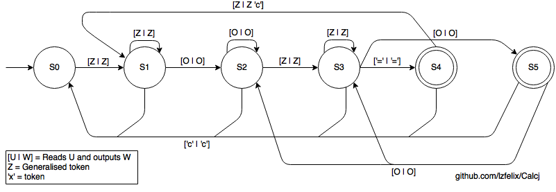

# Calcj

A calculator similar to the standard ones, written in Java using MVC, shipped with as many unit tests as possible using  JUnit. The software is capable of performing the four basic mathematical operations, suports operations chainning  (the user can input the result of the previous operation in the next one), singals handling, character deletion and input  of decimal values.

I started working on this project in order to improve my skills in Java and to use the MVC design pattern in something more  complex than the basic tutorials on internet. I also decided to not use a framework, so I could  see how things really work under the hood. The initial project was much simpler and didn't include support for character deletion, operations chainning and input for negative numbers. However I changed my mind in the middle of the process, so I had to backtrack a few steps in order to make progress.

## Supported actions

The software works as any regular calculator (at least, as far as I know). The user can perform input operations either through the interface or using the keyboard for numbers, operators and decimal separator. The ```'i'``` key can be used to *i*nverse the signal of thenumber currently being input.

**NOTICE:** The computer where I developed this software doesn't have the numpad, so I wasn't able to test these keys. If they are not working (although they should), please, let me know (or feel free to submit a pull request :wink:).

## Unit testing

The project contains as many unit tests as possible on the ```tests``` package. In order to support them I replaced the calculator standard View and Controller layers by a logger class, called ```TapeMachine```, that allows the tester to specify all the inputs at once using a String and retrieve all the output at once as another String. By doing so, validating a tests consists only in comparing the expected String with the obtained one.

This strategy leverages the flexiblity provided by the MVC through decoupling, since it was not necessary to change the calculator's core code *at all* in order to *completely* change the way that input and output are performed. On the other hand, as the reader can inspect on the test units, storing floating point values as Strings may become a hassle in order to compare results of some operations.

Such obstacle can be overcome by replacing the ```TapeMachine```, which keeps the operation results within a String for a  more elaborated logger class that keeps the numeric outputs as ```Double```s, allowing a proper comparisons.

## The calculator as a State Machine

This calculator can be abstracted as state machine in terms of valid inputs according to the previous ones. In order to take advantage of this behaviour (and to facilitate the development), the calculator was modelled as a Mealy machine, thinking  strictly in terms of input and output (as only a Turing Machine would be capable of performing the correct operations given the inputs). Such relaxed representation is depicted below.



In this diagram, the transition rules are represented by the notation ```[W | U]```, which means that the machine receives
a valid input ```W``` in the form of a character, outputs this very same symbol and makes a transition between the states liked by the arrow. In order to keep the diagram clean, equivalent transitions are linked together, for example: the user can at any time input the token ```'c'```, causing the calculator to output this very same token and returning to its initial state ```S0```, analogous to the "*Clear*" operation on the traditional calculators. 

Notice that the set of valid tokens that can form a number may change during its input, due to deletion of prevoius digits, input of the negative sign or decimal separator. In order to accomodate such behaviour and to keep the diagram simple, focused on the calculator states germane to performing operations, such transition rules were abstracted into the ```Z``` transition.

This rule  consits on all valid inputs for the number currently being inserted into the calculator. In such way, all numbers in the interval ```[0-9]```, as well as the deletion operator and the negative sign always belong to this set. Regarding to the negative sign input, one must observe that ```---x = -x``` for any ```x``` Real different from zero (in a purely mathematical point of view). 

However, the decimal separator, ```.``` is initially a valid input to form a number (if it is the first input, then it is preceeded by ```0```), but it becomes invalid as soon as it is used. Conversely it becomes valid again if such symbol is removed by using the deletion input as many times as necessary to erase it from the current number.

Another "generalised" token is represented by the letter ```O```, which consists in the set of the four basic mathematical  operators, namely: ```+```, ```-```, ```*```, ```/```. The user can input an operator as many times as it wants, but only the last one will be used on the next operation  (except when the machine is on the state ```S3```, where an operation using the signal that caused the prevoius transition from states ```S1``` to ```S2``` is performed and its result is used in the upcoming operation with this last operator, that can be overwritten by the user).

Finally, the only "regular" token is ```'c'```, which, as described above causes the calculator to return to its initial state and may also be used as a flag for the View to erase all of its contents.
