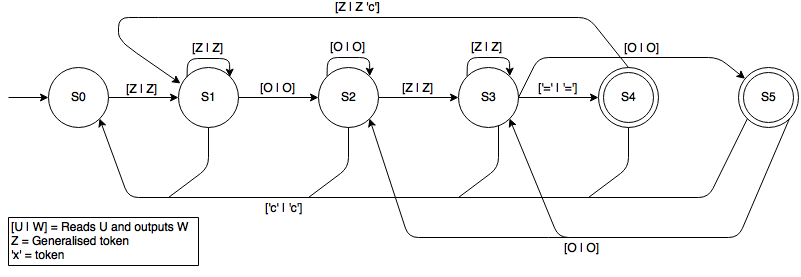

# Calcj
A calculator similar to the standard ones, written in Java using MVC and shipped with as many unit tests as possible using 
JUnit. Thecalculator is capable of performing the four basic mathematical operations, it also suports operations chainning 
(the user can input the result of the previous operation in the next one), singals handling, character deletion and input 
of decimal values.

## Overview

I started working on this project in order to improve my skills in Java and to use the MVC design pattern in something more 
complicated than the basic tutorials without a framework, to see how things really work under the hood. The initial project
consisted on a much simpler calculator without support for character deletion, operations chainning and input for negative 
numbers, however I changed my mind in the middle of the process making me backtrack a few steps in order to advance.

## Supported actions

You can use this calculator as any traditional calculator (that I have ever used in my life). The number keys can be used for
input, as well the corresponding operators in the keyboard. The ```'i'``` key can be used to *i*nverse the signal of the 
number currently being input.

*NOTICE:* The computer where I developed this software doesn't have the numpad, so I wasn't able to test these keys. If they
are not working (although they should), please, let me know (or submit a pull request :wink:).

## Unit testing

The project contains as many unit tests as possible on the ```tests``` repository. In order to support them I replaced the 
user view and controller by a logger class, ```TapeMachine``` that allows the tester to specify all the inputs at once through
a String and retrieve the output in a stanted way as another String (the so-called tape).

This strategy leverages the flexiblity provided by the MVC through decoupling, since it was not necessary *at all* to change the
calculator's core code in order to *completely* change the way that input and output are performed. On the other hand, as the
reader can see, storing floating point values as Strings may become a hassle in order to compare results of some operations.

Such obstacle can be overcome by replacing the ```TapeMachine```, which keeps all the results as Strings by a more elaborated
class that keeps the intermediate outputs produced by the calculator as tokens represented as ```double```s.

## The calculator as a State Machine

This calculator can be abstracted as state machine in terms of valid according to the previous ones. In order to take 
advantage of this behaviour (and to facilitate the development), I modelled the calculator as a Mealy machine, thiking 
strictly in terms of input and output (as only a Turing Machine would be capable of performing the correct operations after
the inputs). Such relaxed representation is depicted below.



In this diagram, the transition rules are represented by the notation ```[W | U]```, which means that the machine receives
a valid input W in the form of a character, outputs this very same character and makes a transition between the states liked
by the arrow. In order to keep the diagram clean, equivalent transitions are linked together, for example: the user can at
any time input the token ```'c'```, causing the calculator to output this very same token and returning to its initial state,
analogous to the "*Clear*" key on the traditional calculators. 

Notice that since the set of valid tokens that can form a number may change during its input due to deletion of prevoius 
digits and input of the negative sign or decimal separator, the transition rules between such states must vary. However, to
keep the diagram concise such scenarios are abstracted into the ```Z``` transition.

Such transition consits on all currently valid inputs for the number being inserted into the calculator. In such way, all
numbers in the interval ```[0-9]```, as well as the deletion operator and the negative sign always belong to this set. 
Regarding to the negative sign input, one must observe that ```---x``` = ```-x``` for any ```x``` Real different from zero
(in a purely mathematical point of view). 

However, the decimal separator, ```.``` initially is a valid input to form a number, but it becomes invalid as soon as it 
is used, but it becomes valid again if such symbol is removed after using the deletion input as many times as necessary to 
erase it from the current number.

Another "generalised" token is represented by the letter ```O```, which consists in the set of the four basic mathematical 
operators, namely: ```+```, ```-```, ```*```, ```/```. The user can input an operator as many times as she want, but only the
last one will take effect (except when the machine is on the state ```S3```, where an operation using the signal that caused 
the prevoius transition from states ```S1``` to ```S2``` is going to be performed and its result will be used in the next
operation with this last operator, that can be overwritten by the user).

The only "regular" token is ```'c'```, which, as described above  causes the calculator to return to its initial state.

